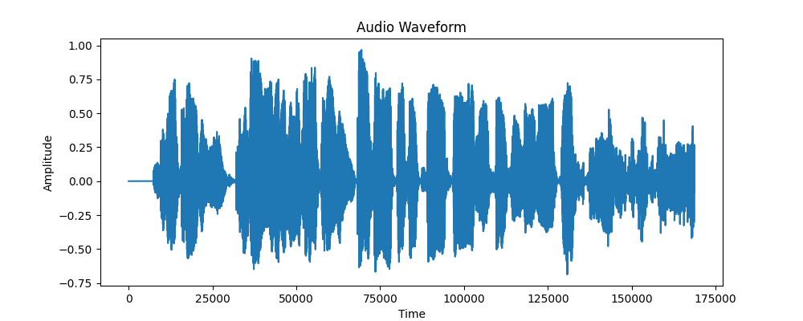

# Raio Project
Projeto de TCC para conclusao da Pos-Graduação em Inteligência Artificial da UNDB São Luís/MA
Autores: Walleson Ferreira e Jandy Cidreira

# Projeto de Processamento de Áudio com IA

Este projeto utiliza técnicas de inteligência artificial para processar arquivos de áudio e oferece as seguintes funcionalidades:
	1.	Transcrição do áudio com identificação de cada falante.
	2.	Detecção de temas sensíveis na transcrição, como drogas, morte e crimes sexuais.
	3.	Seleção de temas a serem identificados pelo usuário.
	4.	Visualização do áudio e dos resultados em uma interface gráfica intuitiva.

# Tecnologias Utilizadas
	•	Google Cloud Speech-to-Text API: Para transcrição de áudio.
	•	NLTK: Para análise de linguagem natural e identificação de temas.
	•	Librosa e Matplotlib: Para manipulação e visualização do áudio.
	•	Flask: Para criar a interface gráfica.

# Como Utilizar

Pré-requisitos
	1.	Credenciais do Google Cloud: Configure a Google Speech-to-Text API e faça o download da chave de serviço JSON.
	2.	Python 3.7+ com as bibliotecas listadas abaixo:
	•	google-cloud-speech
	•	nltk
	•	librosa
	•	matplotlib
	•	flask

# Passo a Passo
	1.	Clone este repositório:

git clone https://github.com/seu-usuario/seu-repositorio.git
cd seu-repositorio

	2.	Instale as dependências:

pip install -r requirements.txt

	3.	Configure a variável de ambiente para as credenciais do Google Cloud:

export GOOGLE_APPLICATION_CREDENTIALS="caminho/para/sua/chave.json"

	4.	Execute o servidor Flask:

python app.py

	5.	Acesse a interface gráfica no navegador:
	•	Geralmente disponível em http://127.0.0.1:5000/.

# Como Funciona
	1.	Transcrição do Áudio:
O sistema utiliza a Google Speech-to-Text API para transcrever o áudio e identificar falantes na conversa.
	2.	Identificação de Temas:
O usuário pode selecionar os temas desejados (drogas, morte ou crimes sexuais) para analisar em quais partes da transcrição essas palavras aparecem.
	3.	Visualização do Áudio:
A interface gráfica exibe o waveform (forma de onda) do áudio processado para facilitar a análise visual.

# Exemplo de Tela

# Estrutura do Projeto

├── app.py               # Código principal com a lógica e interface Flask
├── templates/
│   └── index.html       # Template da interface gráfica
├── static/
│   └── audio_waveform.png  # Arquivo gerado para visualização do áudio
├── requirements.txt     # Dependências do projeto
└── README.md            # Documentação do projeto

# Contribuindo

Contribuições são bem-vindas! Sinta-se à vontade para abrir Issues ou enviar Pull Requests.

# Licença

Este projeto é licenciado sob a MIT License.